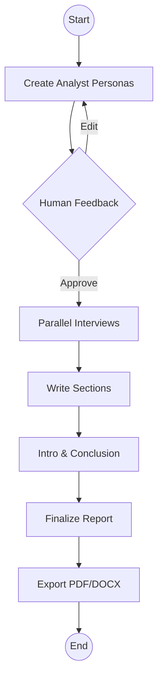

# 🤖 Autonomous Research Report Generator

An advanced multi-agent system powered by **LangGraph**, **Google Gemini**, and **Tavily Search** that automates the entire lifecycle of professional research — from persona-driven analysis to finalized PDF/DOCX reports.

[](https://python.org)
[](https://fastapi.tiangolo.com)
[](LICENSE)

---

## ✨ Features

- **Multi-Agent Pipeline** — Orchestrator, Analyst, Researcher, and Writer agents collaborate autonomously
- **Human-in-the-Loop** — Pause the pipeline to refine analyst personas before research begins
- **Parallel Interviews** — Conducts simultaneous web-search-powered interviews with N analysts
- **Multi-Format Export** — Generate professional PDF and DOCX reports with proper formatting
- **Multi-Provider LLM** — Switch between Google Gemini, OpenAI GPT, and Groq at runtime
- **Web UI** — Full FastAPI dashboard with login, signup, and report progress tracking
- **State Persistence** — Resume interrupted workflows using LangGraph memory checkpoints
- **Structured Logging** — JSON-formatted logs via structlog for production observability
- **Docker & CI/CD** — Multi-stage Docker build + Jenkins pipeline for Azure Container Apps

---

## 🏗 Architecture Overview



Each interview is a sub-graph with multi-turn Q&A powered by Tavily web search. See [**docs/ARCHITECTURE.md**](docs/ARCHITECTURE.md) for full system design with detailed Mermaid diagrams.

---

## 📁 Project Structure

```
automated-research-report-generation/
├── research_and_analyst/           # Main Python package
│   ├── api/                        # FastAPI web application
│   │   ├── main.py                 # App factory, middleware, health check
│   │   ├── routes/                 # HTTP route handlers (auth + reports)
│   │   ├── services/               # Business logic (ReportService)
│   │   ├── models/                 # Pydantic request/response models
│   │   └── templates/              # Jinja2 HTML templates (4 pages)
│   ├── workflows/                  # LangGraph pipelines
│   │   ├── report_generator_workflow.py    # Main DAG (report lifecycle)
│   │   └── interview_workflow.py           # Interview sub-graph
│   ├── schemas/models.py           # Pydantic data models & graph states
│   ├── prompt_lib/                 # Jinja2 prompt templates
│   ├── utils/                      # Config & model loaders
│   ├── database/                   # SQLite + SQLAlchemy (user auth)
│   ├── logger/                     # Structured logging (structlog)
│   ├── exception/                  # Custom exception handling
│   ├── config/configuration.yaml   # LLM & embedding configuration
│   ├── py.typed                    # PEP 561 type checking marker
│   └── notebook/                   # Dev notebooks & test scripts
├── tests/                          # Pytest test suite
│   ├── conftest.py                 # Shared fixtures
│   ├── test_models.py              # Data model tests
│   ├── test_config.py              # Config loader tests
│   ├── test_api.py                 # API endpoint tests
│   ├── test_exception.py           # Exception handling tests
│   └── test_logger.py              # Logger tests
├── static/                         # CSS & JS assets
├── generated_report/               # Output: PDF & DOCX reports
├── docs/                           # Documentation
│   ├── ARCHITECTURE.md             # Full system architecture
│   └── PROJECT_FILES.md            # File-by-file descriptions
├── .github/workflows/ci.yml        # GitHub Actions CI pipeline
├── pyproject.toml                  # Dependencies, ruff, mypy, pytest config
├── uv.lock                         # UV lockfile (reproducible installs)
├── .env.example                    # Environment template
├── .pre-commit-config.yaml         # Pre-commit hooks config
├── .dockerignore                   # Docker build exclusions
├── Dockerfile                      # Multi-stage Docker build
├── Jenkinsfile                     # CI/CD pipeline (Azure)
├── CONTRIBUTING.md                 # Contribution guidelines
├── CHANGELOG.md                    # Version history
└── LICENSE                         # MIT License
```

For detailed descriptions of every file, see [**docs/PROJECT_FILES.md**](docs/PROJECT_FILES.md).

---

## 🚀 Quick Start

### Prerequisites

- **Python 3.11+**
- **[uv](https://docs.astral.sh/uv/)** — install with `curl -LsSf https://astral.sh/uv/install.sh | sh`
- **Google AI API Key** — [Get one here](https://aistudio.google.com/apikey)
- **Tavily API Key** — [Get one here](https://tavily.com)

### Installation

```bash
# Clone the repository
git clone <repo-url>
cd automated-research-report-generation

# Install all dependencies (creates .venv automatically)
uv sync

# Configure environment
cp .env.example .env
# Edit .env with your API keys
```

### Run the Application

```bash
# Development server (with auto-reload)
uv run uvicorn research_and_analyst.api.main:app --reload --port 8000

# Production mode (no reload)
uv run uvicorn research_and_analyst.api.main:app --host 0.0.0.0 --port 8000
```

- **Login Page:** http://localhost:8000/
- **Health Check:** http://localhost:8000/health

### Verify Installation

```bash
uv run python -c "from research_and_analyst.api.main import app; print('✅ FastAPI OK')"
uv run python -c "from research_and_analyst.utils.config_loader import load_config; load_config(); print('✅ Config OK')"
```

---

## 💻 Usage

### Web UI (Recommended)

1. **Sign up** at `http://localhost:8000/signup`
2. **Log in** at `http://localhost:8000/`
3. **Enter a research topic** on the dashboard (e.g., "Impact of AI on Healthcare")
4. **Review analyst personas** — approve or provide feedback to refine them
5. **Download** the generated PDF/DOCX report from the progress page

### CLI Mode

```bash
uv run python research_and_analyst/workflows/report_generator_workflow.py
```

---

## ⚙️ Configuration

### Environment Variables

| Variable | Required | Description |
|:---------|:--------:|:------------|
| `GOOGLE_API_KEY` | ✅ | Google Gemini API key |
| `TAVILY_API_KEY` | ✅ | Tavily web search API key |
| `LLM_PROVIDER` | ✅ | `google`, `openai`, or `groq` |
| `OPENAI_API_KEY` | ⬜ | Required if `LLM_PROVIDER=openai` |
| `GROQ_API_KEY` | ⬜ | Required if `LLM_PROVIDER=groq` |

### LLM Configuration (`research_and_analyst/config/configuration.yaml`)

```yaml
llm:
  google:
    provider: "google"
    model_name: "gemini-2.0-flash"
    temperature: 0
    max_output_tokens: 2048
  groq:
    provider: "groq"
    model_name: "deepseek-r1-distill-llama-70b"
  openai:
    provider: "openai"
    model_name: "gpt-4o"
```

---

## 🐳 Docker Deployment

```bash
# Build the image
docker build -t research-report-app:latest .

# Run with environment file
docker run -p 8000:8000 --env-file .env research-report-app:latest
```

### Azure Container Apps (CI/CD)

The project includes a complete Jenkins pipeline for Azure deployment:

1. **Provision infrastructure:** `./setup-app-infrastructure.sh`
2. **Build & push image:** `./build-and-push-docker-image.sh`
3. **Deploy via Jenkins:** The `Jenkinsfile` handles the full pipeline

---

## 🛠 Development

### Common Commands

```bash
uv sync                   # Install all dependencies
uv sync --extra dev       # Install with dev tools (pytest, ruff, mypy)
uv lock                   # Regenerate lockfile after editing pyproject.toml
uv run <cmd>              # Run any command inside the managed .venv
```

---

## 🧪 Testing & Code Quality

### Run Tests

```bash
# Install dev dependencies (first time)
uv sync --extra dev

# Run the full test suite (38 tests)
uv run pytest

# Run with verbose output
uv run pytest -v

# Run a specific test file
uv run pytest tests/test_api.py
```

### Linting & Formatting (Ruff)

```bash
# Check for lint issues
uv run ruff check .

# Auto-fix lint issues
uv run ruff check --fix .

# Check formatting
uv run ruff format --check .

# Apply formatting
uv run ruff format .
```

### Type Checking (Mypy)

```bash
uv run mypy research_and_analyst/
```

### Pre-Commit Hooks

```bash
# Install hooks (one-time setup)
uv run pre-commit install

# Run all hooks on staged files
uv run pre-commit run --all-files
```

---

## 🔄 CI/CD

### GitHub Actions

The project includes a GitHub Actions CI pipeline (`.github/workflows/ci.yml`) with 3 parallel jobs:

| Job | What it does |
|:----|:-------------|
| **Lint & Format** | `ruff check` + `ruff format --check` |
| **Type Check** | `mypy research_and_analyst/` |
| **Tests** | `pytest` (38 tests) |

Runs automatically on every push and PR to `main`.

### Jenkins (Azure)

The `Jenkinsfile` pipeline handles Azure Container Apps deployment:

1. **Provision infrastructure:** `./setup-app-infrastructure.sh`
2. **Build & push image:** `./build-and-push-docker-image.sh`
3. **Deploy via Jenkins:** Full pipeline from checkout to deployment verification

---

## 📖 Documentation

| Document | Description |
|:---------|:------------|
| [Architecture](docs/ARCHITECTURE.md) | Full system design with Mermaid diagrams |
| [Project Files](docs/PROJECT_FILES.md) | File-by-file component descriptions |
| [Contributing](CONTRIBUTING.md) | How to contribute |
| [Changelog](CHANGELOG.md) | Version history |

---

## 📝 License

[MIT License](LICENSE) — Developed by Sunny Savita.
