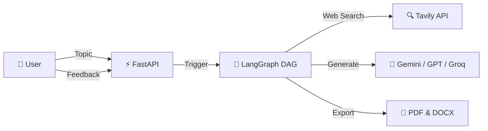
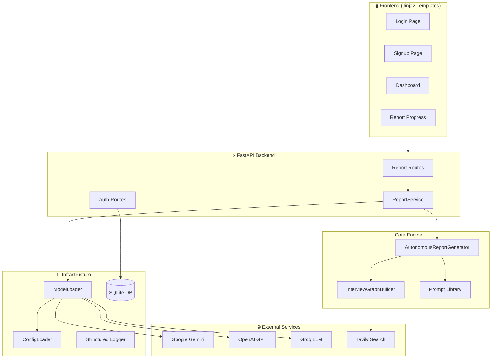
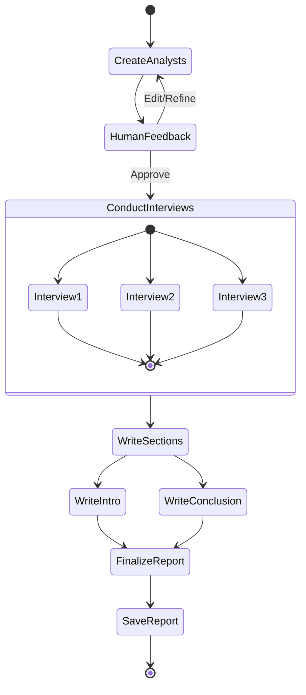
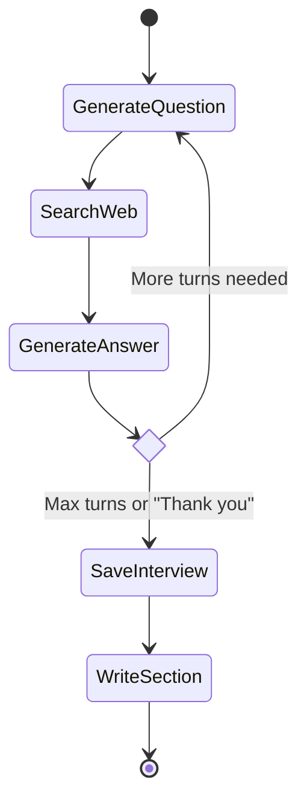
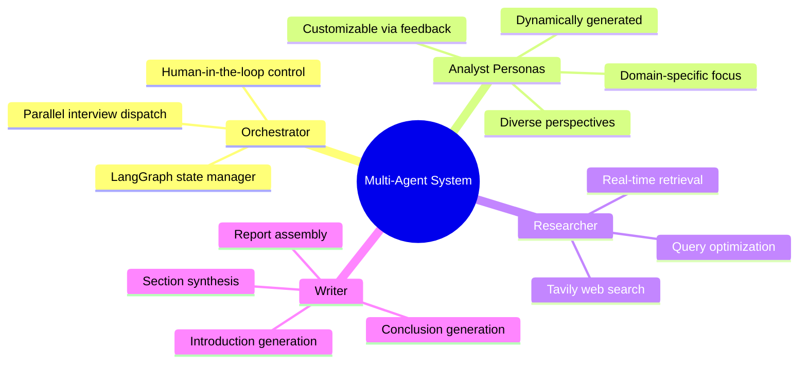
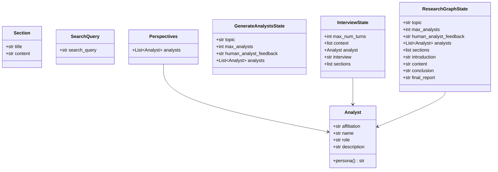
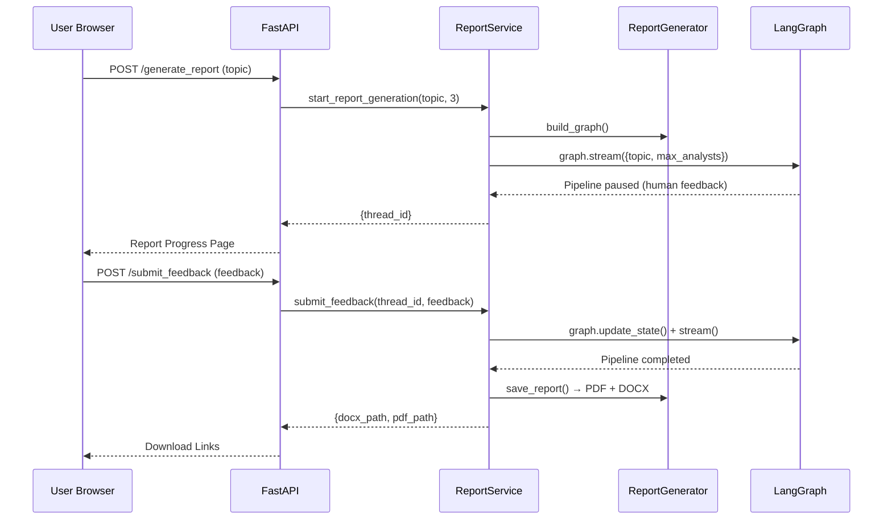
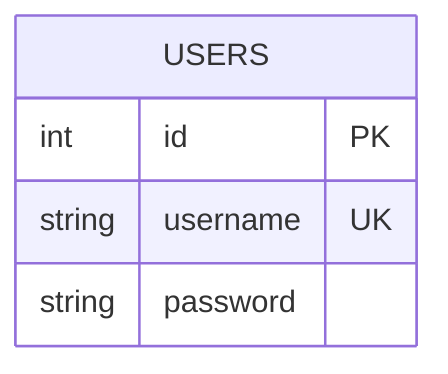
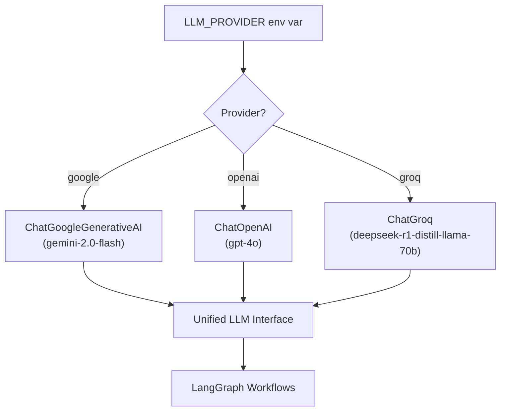

# 🏗 System Architecture

> Autonomous Research Report Generator — a multi-agent system powered by **LangGraph**, **Google Gemini**, and **Tavily Search**.

---

## Table of Contents

- [System Overview](#system-overview)
- [High-Level Architecture](#high-level-architecture)
- [LangGraph DAG — Report Generation](#langgraph-dag--report-generation)
- [Interview Sub-Graph](#interview-sub-graph)
- [Agent Roles](#agent-roles)
- [Data Models & State Management](#data-models--state-management)
- [API Layer Architecture](#api-layer-architecture)
- [Database Schema](#database-schema)
- [Configuration Management](#configuration-management)
- [Multi-Provider LLM Strategy](#multi-provider-llm-strategy)

---

## System Overview

The system automates the full lifecycle of professional research report generation:

1. **Persona Creation** — AI generates diverse analyst personas tailored to the research topic
2. **Human-in-the-Loop Review** — The pipeline pauses for human feedback on analysts
3. **Parallel Interviews** — Each analyst conducts a web-search-powered interview
4. **Report Synthesis** — Interviews are compiled into sections, introduction, and conclusion
5. **Export** — Final report is saved as PDF and DOCX



---

## High-Level Architecture



---

## LangGraph DAG — Report Generation

The main report generation workflow is a **stateful directed acyclic graph** (DAG) managed by LangGraph with human-in-the-loop interruptions.



### Node Descriptions

| Node | Class Method | Purpose |
|:-----|:------------|:--------|
| **Create Analysts** | `create_analyst()` | Generate N analyst personas with distinct perspectives (Economic, Technical, Social, etc.) |
| **Human Feedback** | `human_feedback()` | LangGraph interrupt — user reviews and optionally refines analysts |
| **Conduct Interviews** | `initiate_all_interviews()` | Fan-out: each analyst triggers a parallel Interview sub-graph |
| **Write Sections** | `write_report()` | Compile all interview sections into unified report content |
| **Write Introduction** | `write_introduction()` | Generate the report introduction from all sections |
| **Write Conclusion** | `write_conclusion()` | Generate the conclusion from all sections |
| **Finalize Report** | `finalize_report()` | Assemble intro + content + conclusion into `final_report` |
| **Save Report** | `save_report()` | Export to PDF and DOCX in `generated_report/` |

---

## Interview Sub-Graph

Each interview is a self-contained LangGraph sub-graph managing a multi-turn conversation between an analyst and an AI expert.



### Interview Flow Details

| Step | Method | Details |
|:-----|:-------|:--------|
| **Generate Question** | `_generate_question()` | Analyst asks a question based on persona and prior context |
| **Search Web** | `_search_web()` | Structured query → Tavily API → web context retrieval |
| **Generate Answer** | `_generate_answer()` | Expert synthesizes answer from retrieved context |
| **Save Interview** | `_save_interview()` | Store full Q&A transcript as interview record |
| **Write Section** | `_write_section()` | Convert interview transcript into a report section |

### Turn Control Logic
- **Maximum turns** configurable via `max_num_turns` in the state
- **Natural termination**: Interview ends when analyst says "Thank you so much for your help!"
- Each turn adds messages to the conversation buffer

---

## Agent Roles



| Agent | Implementation | Responsibility |
|:------|:-------------|:---------------|
| **Orchestrator** | `AutonomousReportGenerator` + LangGraph | Manages the pipeline, dispatches sub-graphs, handles state |
| **Analyst** | Dynamically generated `Analyst` personas | Provides perspective-driven questions during interviews |
| **Researcher** | Tavily Search integration in `InterviewGraphBuilder` | Performs web searches, retrieves context for answers |
| **Writer** | LLM-powered nodes in the report graph | Synthesizes interview transcripts into professional prose |

---

## Data Models & State Management

### Core Models (`schemas/models.py`)



### State Flow

| State | Used By | Key Fields |
|:------|:--------|:-----------|
| `GenerateAnalystsState` | Analyst creation node | `topic`, `max_analysts`, `human_analyst_feedback`, `analysts` |
| `InterviewState` | Interview sub-graph | `analyst`, `context`, `interview`, `sections`, `max_num_turns` |
| `ResearchGraphState` | Main report DAG | `sections`, `introduction`, `content`, `conclusion`, `final_report` |

---

## API Layer Architecture



### API Endpoints

| Method | Path | Handler | Description |
|:-------|:-----|:--------|:------------|
| `GET` | `/` | `show_login` | Login page |
| `POST` | `/login` | `login` | Authenticate user |
| `GET` | `/signup` | `show_signup` | Signup page |
| `POST` | `/signup` | `signup` | Register user |
| `GET` | `/dashboard` | `dashboard` | User dashboard |
| `POST` | `/generate_report` | `generate_report` | Start report pipeline |
| `POST` | `/submit_feedback` | `submit_feedback` | Submit analyst feedback |
| `GET` | `/download/{file}` | `download_report` | Download generated report |
| `GET` | `/health` | `health_check` | Health check |

---

## Database Schema



- **Engine**: SQLite via SQLAlchemy
- **Auth**: Passwords hashed with bcrypt (via passlib)
- **Sessions**: In-memory cookie-based session management
- **Auto-creation**: Tables created on first import of `db_config.py`

---

## Configuration Management

### Configuration Hierarchy

```
configuration.yaml (YAML config)
    ├── astra_db.collection_name    → AstraDB collection (if used)
    ├── embedding_model.provider    → "google"
    ├── embedding_model.model_name  → "models/text-embedding-004"
    ├── retriever.top_k             → 4
    └── llm
        ├── google.model_name       → "gemini-2.0-flash"
        ├── groq.model_name         → "deepseek-r1-distill-llama-70b"
        └── openai.model_name       → "gpt-4o"
```

### Configuration Resolution Priority
1. Explicit `config_path` argument
2. `CONFIG_PATH` environment variable
3. Default: `<project_root>/config/configuration.yaml`

### Environment Variables

| Variable | Purpose | Required |
|:---------|:--------|:---------|
| `GOOGLE_API_KEY` | Google Gemini API access | ✅ |
| `TAVILY_API_KEY` | Tavily web search access | ✅ |
| `LLM_PROVIDER` | LLM provider selection (`google`, `openai`, `groq`) | ✅ |
| `OPENAI_API_KEY` | OpenAI API access | Only if provider = `openai` |
| `GROQ_API_KEY` | Groq API access | Only if provider = `groq` |
| `CONFIG_PATH` | Custom config file path | ❌ |

---

## Multi-Provider LLM Strategy



The `ModelLoader` class provides a unified interface for swapping LLM providers:
- **Runtime-configurable** via `LLM_PROVIDER` environment variable
- **Consistent API** — all providers return LangChain-compatible chat models
- **Temperature & token control** — per-provider settings in `configuration.yaml`
- **API key management** — `ApiKeyManager` loads and validates all keys from `.env`
